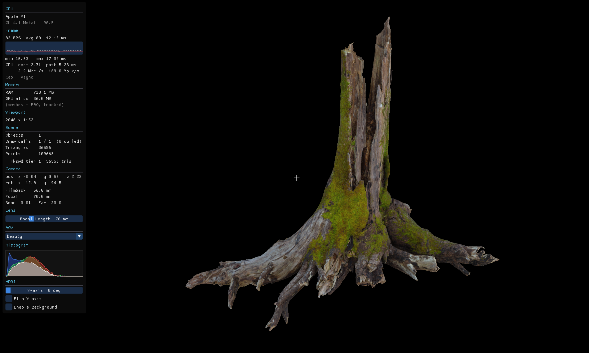

# KODAK

**Project ID:** vN8qTe3L

<p align="center">
  
</p>

## Requirements

- macOS (OpenGL 3.3 Core Profile via system framework)
- CMake ≥ 3.20
- C++17 compiler

## Build & Run

Run from the **project root** (shaders and assets load relative to the working directory):

```bash
make        # build → ./build/KODAK
make run    # build and run
make clean  # wipe build/
```

## Controls

| Input | Action |
|-------|--------|
| W / A / S / D | Fly forward / left / back / right |
| E / Q | Fly up / down |
| LMB click | Set orbit pivot at screen centre (depth-sampled) |
| LMB drag | Tumble camera around pivot |
| R / G / B | Toggle red / green / blue channel isolation (press again to clear) |
| Y | Toggle luminance AOV (Rec. 709); press again to restore previous AOV |
| I | Toggle invert (`1 − colour`) |
| H | Show / hide HUD stats panel |
| ESC | Quit |

## AOV Panel

| Mode | Channel |
|------|---------|
| beauty | PBR: Fresnel-weighted diffuse + specular IBL |
| alpha | Albedo alpha channel |
| bounds | Flat grey geometry + yellow AABB wireframe box (GL_LINES, depth-tested) |
| wireframe | Triangle edges |
| depth | Linearised scene depth |
| albedo | Raw albedo texture |
| hsv | Hue / saturation / value decomposition |
| luminance | Rec. 709 greyscale |
| direct_diffuse | Full irradiance diffuse lobe |
| direct_refl | Fresnel-weighted reflection lobe |
| world_pos | World-space position normalised within scene AABB |
| world_normals | World-space vertex normals |
| uv | UV coordinates |
| shading_normal | TBN-perturbed shading normal |
| fresnel | F term — red (facing) → green (grazing) |
| occlusion | SSAO occlusion |

## Dependencies

Fetched automatically by CMake:

| Library | Version | Purpose |
|---------|---------|---------|
| [GLFW](https://www.glfw.org) | 3.4 | Window + OpenGL context + input |
| [GLM](https://github.com/g-truc/glm) | 1.0.1 | Math (vectors, matrices) |
| [Dear ImGui](https://github.com/ocornut/imgui) | 1.91.9 | HUD overlay |
| [cgltf](https://github.com/jkuhlmann/cgltf) | 1.14 | glTF 2.0 parsing (header-only) |
| [nlohmann/json](https://github.com/nlohmann/json) | 3.11.3 | JSON config (header-only) |
| [Catch2](https://github.com/catchorg/Catch2) | 3.7.1 | Test framework (tests only) |

OpenGL, Cocoa, stb_image, and stb_image_write are provided by the macOS system frameworks and committed headers respectively.

## Testing

```bash
# Configure + build (includes tests_kodak binary)
cmake --preset default && cmake --build --preset default -j

# Run all 92 tests via CTest
ctest --preset default --output-on-failure

# Run directly for coloured ✓ / ✗ output per test
./build/tests_kodak
```

Tests run headless — no display or GPU session required. Each test case registers individually in CTest so `ctest -R <pattern>` filters by name (e.g. `ctest -R Camera`).

| Suite | Tests | Coverage |
|-------|-------|---------|
| Config | 7 | JSON load/save, per-key defaults, malformed input, round-trip |
| Camera | 9 | FOV from filmback/focal length, projection depth terms, viewMatrix orthonormality, front direction, pitch clamp |
| Frustum | 8 | Plane extraction, unit-length normals, sphere inside/outside/boundary |
| Mesh | 6 | Bounding radius, AABB, index/triangle counts, move semantics |
| Shader | 4 | Compile success, syntax error throws, missing file throws |
| Texture | 5 | `white()` and `flatNormal()` pixel correctness, bind unit, move semantics |
| PBR math | 11 | Schlick Fresnel, Smith G masking, IOR→F0, metallic blend, energy conservation |
| AOV modes | 16 | All 16 view modes verified by rendering to a 1×1 FBO and reading back the pixel |
| SSAO math | 11 | Depth reconstruction round-trip, smoothstep range check, kernel hemisphere/determinism |
| CPU math | 20 | EMA FPS, HDRI Euler rotation, histogram triangle kernel, sqrt normalisation, grayscale/near-binary detection, frame-time min/max |
| SSAO blur | 1 | Separable H×V matches 2D box filter to within 2e-5 per pixel |

## Architecture

```
src/
├── main.cpp                — render loop, G-buffer, SSAO pipeline, config wiring
├── core/
│   ├── config.hpp/.cpp     — JSON profile/scene loader/saver (nlohmann/json)
│   └── log.hpp             — structured logger (DEBUG/INFO/WARN/ERROR → stderr)
├── render/
│   ├── window.hpp/.cpp     — GLFW window + OpenGL 3.3 Core context
│   ├── shader.hpp/.cpp     — GLSL compile/link, uniform cache, pre-cached setAt() overloads
│   ├── mesh.hpp/.cpp       — VAO/VBO/EBO geometry, bounding sphere + AABB
│   ├── texture.hpp/.cpp    — PNG/JPG/HDR loading via stb_image (RGBA8 + RGB16F)
│   ├── model.hpp/.cpp      — glTF 2.0 loader (cgltf), Model/SubMesh, node transform walk
│   └── frustum.hpp         — Gribb-Hartmann frustum planes, sphere culling test
├── camera/
│   └── camera.hpp/.cpp     — filmback/focal-length camera, LMB orbit (depth-sampled pivot)
└── ui/
    ├── hud.hpp/.cpp        — Dear ImGui overlay (crosshair, AOV, histogram, stats)
    └── menu_osx.hpp/.mm    — Native macOS menu bar via Cocoa (ObjC++ bridge)
shaders/
├── geometry/
│   └── pbr.vert/.frag      — MVP transform, G-buffer MRT, PBR BSDF + IBL texture lookups, 16 AOV modes
├── bake/
│   ├── irradiance.frag     — Fibonacci cosine hemisphere integration → irradiance map
│   ├── prefilter.frag      — GGX lobe integration per roughness mip → prefiltered specular map
│   └── brdf_lut.frag       — split-sum BRDF LUT (F_scale, F_bias) per Karis 2013
├── post/
│   ├── blit.vert/.frag     — fullscreen composite, SSAO multiply, channel overlay
│   ├── ssao.vert/.frag     — SSAO compute (depth reconstruction, UBO kernel)
│   ├── ssao_blur.frag      — separable horizontal blur pass
│   └── ssao_blur_v.frag    — separable vertical blur pass
├── sky/
│   └── sky.vert/.frag      — equirectangular HDRI skydome (rotation, exposure, flip)
└── debug/
    └── bounds.vert/.frag   — flat-colour GL_LINES pass for the AABB wireframe box
tests/
├── gl_context.hpp/.cpp     — headless GLFW singleton (hidden 1×1 window, GL 3.3 Core)
├── reporter.cpp            — Catch2 listener: ✓ PASSED (green) / ✗ FAILED (red)
├── test_camera.cpp         — projection math, viewMatrix, front direction, pitch clamp
├── test_config.cpp         — JSON load/save round-trip, defaults, malformed input
├── test_frustum.cpp        — plane extraction, sphere inside/outside/boundary
├── test_mesh.cpp           — bounding radius, AABB, counts, move semantics
├── test_shader.cpp         — compile success/failure, missing file
└── test_texture.cpp        — pixel correctness, bind unit, move semantics
profile.json                — renderer config (resolution, IBL samples, SSAO, IOR)
scene.json                  — scene content (camera, HDRI, geometry, material overrides)
```

## Roadmap

| Task | Status |
|-----------|--------|
| Hello 3D World — window, camera, primitives, diffuse shading | ✓ |
| Texture Loading — stb_image, UV coords | ✓ |
| Debug HUD — Dear ImGui overlay, view modes, FBO render scale | ✓ |
| Optimisation — smooth FPS, GPU timer, frustum culling | ✓ |
| Geometry Loading — glTF 2.0 via cgltf | ✓ |
| HDRI Skydome — equirectangular sky, diffuse irradiance, linear pipeline | ✓ |
| Project Quality — SSAO, JSON config, render scale, Z-up | ✓ |
| Orbit Camera — LMB depth-sampled pivot, diffuse IBL fix | ✓ |
| PBR BSDF — Schlick Fresnel, IOR-derived F0, energy-conserving Ld+Ls | ✓ |
| GUI & Debug — native macOS menu, crosshair, HDRI controls, AOV remap | ✓ |
| Render Performance — uniform cache, CPU normal matrix, half-res SSAO, release preset | ✓ |
| Quick fixes — world_pos AABB normalisation, bounds AOV, Sky Background menu toggle | ✓ |
| Build & Run — single-step build and run workflow (./build/KODAK no 'dev' or 'release') | ✓ |
| Logging & Diagnostics — debug logging, warnings, errors, renderer statistics, screenshot metadata | ✓ |
| Performance Profiling (GUI) — render time, rays/sec, samples/sec, memory usage | ✓ |
| Hotkeys — RGBA channel overlay, luminance (Y), invert (I), HUD toggle (H), focal length slider | ✓ |
| AOVs — Reorder, add HSV AOV, RGB histogram in HUD. 2-channel AOV support (UV/Fresnel), histogram artefact fixes (diagonal fringe, endpoint spikes), FPS graph avg overlay. | ✓ |
| Directory Structure — domain-based layout: core/, render/, camera/, ui/ | ✓ |
| Tests — Catch2 v3 suite, 91 tests / 571 assertions, PBR math, all 16 AOVs, SSAO, CPU math, headless GL | ✓ |
| Performance profiling and optimisation — benchmark infrastructure, GPU query rings, async PBO readback, separable SSAO blur, IBL precomputation, SSAO kernel UBO, uniform location pre-cache: **3.2× FPS** (66→213) | ✓ |
| Camera &  — ISO, f-stop, shutter speed, focus distance, aspect ratio | planned |
| Color Management — OpenEXR I/O linear pipeline, OCIO ACES workflow w/ OCIO Display Transform (sRGB / Rec.709), White Balance & Kelvin-based lighting controls, | planned |
| Rendering — Thin lens model, Physical-based spectral GPU path tracing render engine, Monte Carlo Unbiased Global Illumination (Indirect/Multiple Scattering), Correct exposure, Linear workflow, Adaptive Sampling / Multiple importance sampling (MIS), Recursive tracing, Russian roulette termination, Energy conservation, Spectral light transport, Wavelength sampling, Spectral materials, Spectral dispersion, BSDF / PBR materials, BRDF sampling + Importance Sampling, Next-event estimation, HDR IBL, Tone-mapping, Area lights, Shadows / Soft shadows, BVH acceleration, Fresnel effects, Caustics, Path throughput accumulation, Radiance estimation formulation | planned |
| Post Lens Effects - DoF, chromatic aberration, anamorphic lenses, film grain
| Displacement: Height map, Disp. bounds, OpenSubD | planned |
| Asset Management — geometry, materials (files and presets), hdr, camera presets | planned |
| Test Scenes — teapot, cornell box, three-sphere material test with curved backdrop | planned |
| HUD: Waveform, AOV min/max (Depth), 2D groundplane, overlay - aspect ratio, Rule-of-Thirds grid | planned |
| Future Features — alembic (cam and geo), background, turntable, macbeth ColorChecker, diffusion rendering, cross-platform support (NVIDIA and Apple Silicon) | planned |